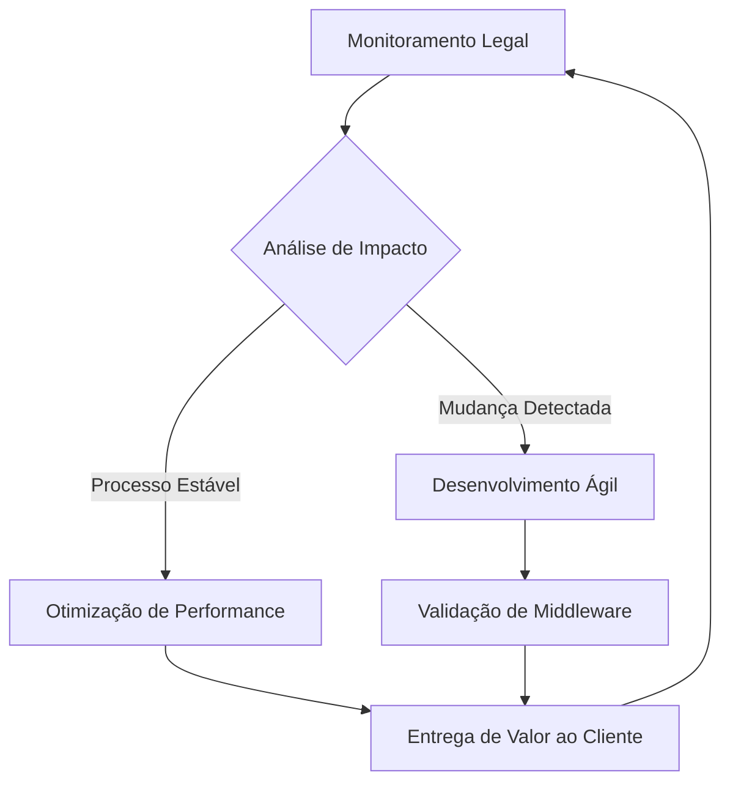

  

> **Construindo o amanhã da gestão fiscal e contábil hoje.**

---

## 🏛️ Sobre Nós

A **Domani Sistemas** é uma softhouse dedicada a transformar a complexidade da legislação tributária em soluções tecnológicas fluidas, precisas e inovadoras. Com foco no setor fiscal, nossa missão é proporcionar segurança e eficiência para empresas que buscam excelência operacional.

O nome **Domani** (*amanhã*, em italiano) reflete nossa visão: antecipar as necessidades do mercado e entregar tecnologias que preparam nossos clientes para os desafios do futuro.

---

## 🎯 Nossa Missão

Simplificar a conformidade fiscal através de software intuitivo e robusto, permitindo que nossos parceiros foquem no que realmente importa: o crescimento de seus negócios.

## 🌟 Nossos Valores

- **Inovação Contínua:** Nunca paramos de evoluir. O estado da arte tecnológica é o nosso ponto de partida.
- **Precisão Cirúrgica:** No domínio fiscal, cada centavo e cada código importam. Nossa obsessão é o erro zero.
- **Relacionamento Próximo:** Não somos apenas fornecedores; somos parceiros estratégicos dos nossos clientes.
- **Ética e Transparência:** Atuamos com integridade total, garantindo a segurança dos dados e o respeito às normas.

## ⚙️ O Ciclo Domani

Nossa metodologia de trabalho foca no aprimoramento contínuo e na conformidade em tempo real.

---

## 🛠️ Nosso Ecossistema Técnico

Construímos soluções robustas focadas em escalabilidade e facilidade de uso.

| Pilar | Tecnologia | Objetivo |
| :--- | :--- | :--- |
| **Interface** | Flutter | Experiência nativa e consistente em Desktop/Web. |
| **Dados** | PostgreSQL | Integridade e segurança absoluta das informações fiscais. |
| **Negócio** | Dart / Go | Alta performance em processamento e automação. |
| **Integração** | REST APIs | Conectividade total com órgãos reguladores (SEFAZ, Receita). |

---

---

## 🚀 Projetos em Destaque

### 📂 [Domani Fiscal](https://github.com/pablogeokar/domani-fiscal)
Nossa principal plataforma de gestão e automação fiscal, focada em simplicidade e poder de processamento.

---

## 📩 Contato

Gostaria de saber mais ou ser nosso parceiro? Estamos à disposição para transformar o futuro da sua empresa.

- **Website:** [www.domanisistemas.com.br](http://www.domanisistemas.com.br)
- **LinkedIn:** [Domani Sistemas no LinkedIn](https://linkedin.com/company/domanisistemas)
- **Email:** contato@domanisistemas.com.br

---

  Feito com ❤️ pela equipe da <b>Domani Sistemas</b>

